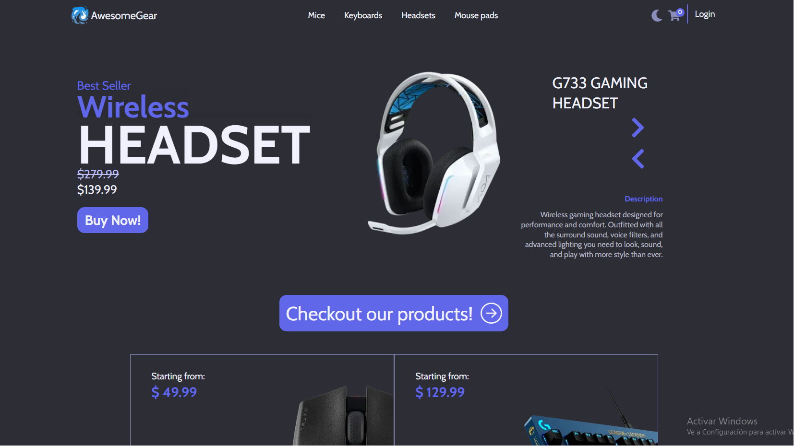

# Ecommerce - Awesome Gear



Ecommerce website built with NextJs.

- Demo live: https://awesome-gear-shop.vercel.app/

## Features

- Registration
- Input validation on forms
- Authentication
- Protected routes
- Smooth animations
- Product data managed by Sanity (headless CMS)
- User and order data managed with MongoDB
- Checkout with Stripe
- User profile with order history
- Server Side Rendered homepage for better SEO
- Static Site Generated individual product pages for the fastest response
- Product filtering on shop page
- Light/Dark theme
- Responsive design

## Chrome lighthouse scores:

---

These are the scores of the test while using incognito mode:


## Environment Variables

---

To run this project, you will need these environment variables on your .env:

`NEXT_PUBLIC_SANITY_TOKEN`

`NEXT_PUBLIC_STRIPE_PUBLISHABLE_KEY`

`NEXT_PUBLIC_STRIPE_SECRET_KEY`

`NEXTAUTH_SECRET`

`MONGODB_URI`

First, run the development server:

```bash
npm install --legacy-peer-deps
# to avoid deps bugs

```

Next:

```bash
npm install -g @sanity/cli
cd sanity_ecommerce
npm install --legacy-peer-deps
sanity start
```

Open [http://localhost:3333](http://localhost:3333) with your browser to see the sanity studio where you can add the products.
You can find the images and data of the products i used in the assets folder

Then:

```bash
npm run dev
```

Open [http://localhost:3000](http://localhost:3000) with your browser to see the result.

## Technologies used for this project:

---

- Next.js
- NextAuth.js
- Sanity
- MongoDB
- Framer Motion

## Deployment:

---

This project is deployed in Vercel, the DB is hosted using MongoDB Atlas

## Decisions:

---

- ### Why did you build this project?

I wanted to try Next Js and check why is it so popular and what a better way to learn how to use a tool than building something with it. I gave it some thought and decided between 3 options:

1. An app that helps to manage inventories, profits, clients, and tracks issues for any shop dedicated to fix electronics, I've worked in this field in the past and i really wanted one app like that with a modern UI.
2. An online Shop where i can sell anything i want, AKA, an Ecommerce.
3. An app dedicated to solve a problem i have with a video game i like.

At the end i went with the 2nd option, because is more general and more people might need something like that, that been said i plan to build the other apps anyways because those a problems that need a solution and programming is fun.

- ### TypeScript vs JavaScript

When i started this project Next.Js 12 had a warning in their documentation about that using TypeScript with ServerSideProps could bring some issues, as a new dev diving into Next.Js i wasn't going to take the risk of adding bugs to my code for free. So for this project i decided to go with JavaScript.

- ### Design

I took inspiration from some designs i saw on dribbble and added my own personal style. I know it has room for improvement (Im not a designer) but im still proud of the visuals.

- ### Styling

For this project i could have used Tailwind Css but i stayed with vanilla CSS just to not throw some old code i had. For anything i build with vanilla CSS i always use BEM convention, too good not to use it.

- ### Why MongoDB with Sanity?

At the beginning of this project i didn't want to build a full backend so i went with Sanity but after some time i decided to take this project to the next level, many features i wanted required a database, for me that don't know SQL, MongoDB was an easy pick.

- ### Are you going to add different authentication methods?

Yes, Im gonna add authentication with Google and Facebook but not now because Next Auth requires an "adapter" to save the users data in the database and for MongoDB it uses the "mongodb" module as adapter and currently Im using Mongoose as a driver to connect with MongoDB Atlas, which creates a conflict with the models if i try to install both, there's actually an issue about this topic in Next Auth's repository in github.

- ### Testing

For this project i didn't use any testing strategy, that said as soon as I finish building my personal portfolio, i plan to refactor some code,add new features and expand this project even more. That's why i believe adding unit and E2E testing to some specific parts that i plan to refactor will help deliver more reliable code.

## Next Steps

---

For now Im gonna leave this project as it is, because I need to focus in another projects, but as soon Im done with those I plan to go work on these:

- Migrate this project to TypeScript and NextJs 13.
- Take Sanity out of the project and use MongoDB to manage the product's data.
- Refactor some CSS code, maybe split it into modules.
- Improve the design and animations.
- Add an Admin panel, for products, users and orders management.
- Create a webhook to monitor stripe payment confirmation.
- Separate shipping address, payment and checkout in to different pages.
